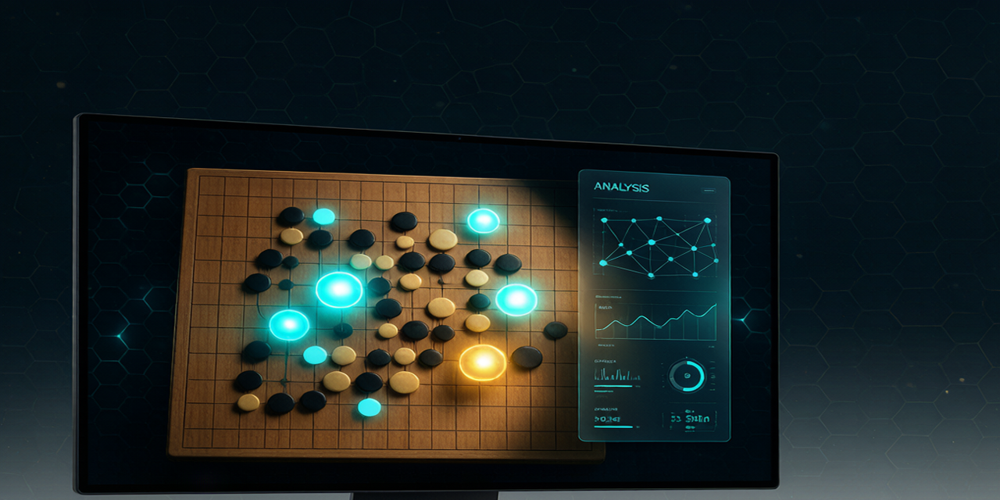

# GoEye —— 实时围棋棋盘识别 + 分析悬浮窗



一个常驻 macOS 的悬浮小工具：框选屏幕上的围棋盘 → 实时识别局面 → 调用围棋引擎告诉你**下一步怎么走**。
识别无需联网、无需权重；分析需要本地装一个引擎（下面两选一，或都不装只识别）。

---

## 一、环境要求

- macOS（Intel x86_64 或 Apple Silicon 均可）
- Python 3.13（本机已用 WorkBuddy 管理的 venv 装好依赖）
- 本机已装好的话，直接跳到 **第三步 · 运行**。

---

## 二、安装（只需做一次）

### 1) Python 依赖

```bash
# 新机器 / 全新环境才需要；本机依赖已在 venv 里装好
pip install -r requirements.txt
# 依赖内容：pyqt6, opencv-python-headless, mss, numpy
```

> 注意：PyQt6 实际上拆成了三个轮子（`PyQt6` + `PyQt6-Qt6` + `PyQt6-sip`），
> 用 `pip install -r requirements.txt` 会一次性拉齐，不要手动只装 `PyQt6`。

### 2) 选一个围棋引擎（分析功能用，识别不依赖它）

#### 方案 A · KataGo（推荐，棋力最强）
```bash
brew install katago          # 提供 katago 可执行文件（macOS 走 Metal 后端）
```
- 神经网络权重文件**不纳入 Git 仓库**（体积大，约 60MB）。克隆后请自行下载并放到 `models/`：
  ```bash
  mkdir -p models
  # 从 KataGo 发布页下载权重（任选其一或都要），放到 models/ 下：
  #   g170e-b10c128.txt.gz   较快
  #   g170e-b15c192.txt.gz   较强
  # 发布页：https://github.com/lightvector/KataGo/releases
  ```
- 引擎自动按 `metal → opencl → eigen` 顺序尝试后端，macOS 一般走 Metal。

#### 方案 B · GNU Go（零配置，棋力弱但很轻）
```bash
brew install gnugo
```
- 装完不用任何配置，App 启动时会**自动发现** `gnugo` 并直接给出落子建议。
- 适合只想快速看个"该下哪儿"、不想装 KataGo 的情况。

#### 方案 C · 都不装
App 仍然能跑，进入**仅识别模式**：正常识别棋盘并显示局面，面板会提示如何开启分析。
这样你随时 `brew install gnugo` 或 `brew install katago` 后即可启用分析，无需重启。

> 引擎优先级：检测到 KataGo 就用 KataGo；否则用 GNU Go；都没有则仅识别。

---

## 三、运行

```bash
cd goeye
./run.sh              # 启动悬浮窗
./run.sh --test       # 跑无头自测（识别 100% 准确率 + 引擎解析单测）
```

> `run.sh` 默认用 WorkBuddy 管理的 venv Python；找不到时自动回退到 `python3`。

### 双击启动（免开终端）
项目已生成一个启动器应用，放在 **`/Applications/GoEye.app`**，双击即可运行（等价于 Automator 的"运行 Shell 脚本"启动 app）：

- 首次双击时，macOS 会把它列入 **屏幕录制 / 辅助功能** 授权列表，按第四节开好权限即可。
- 运行日志写到 `/tmp/goeye.log`，启动异常时方便排查。
- 若 `/Applications` 不可写，会退而装到 `~/Applications/GoEye.app`。

---

## 四、首次必做的系统授权（否则会黑屏 / 点不动）

macOS 对屏幕截屏和模拟点击有严格权限，第一次用要开：

1. **屏幕录制**（截屏识别必需）
   `系统设置 → 隐私与安全性 → 屏幕录制` → 勾选**真正运行 GoEye 的那个程序**：
   - 双击 `GoEye.app` 启动 → 勾选 **GoEye**；
   - 在终端跑 `./run.sh` → 勾选你用的**终端**（Terminal / iTerm / Warp 等）；
   - 列表里已有的 `python3` 条目也保留，但它只是解释器，真正申请权限的是"启动它的父程序"。
   - 改完权限后**退出 GoEye 并重新打开**才会生效（macOS 不会热生效）。
   - 没授权会导致截到的图是全黑，识别不出棋子。
2. **辅助功能**（"替我落子"原生点击必需，仅用此功能才需要）
   `系统设置 → 隐私与安全性 → 辅助功能` → 给上面那个运行 GoEye 的程序授权。

> 小知识：屏幕录制权限是按"程序（可执行路径）"授予的。区域选择时如果看到**画面跳到另一个桌面、一片黑**，那是浮窗在 macOS 上误用了全屏模式（旧行为），当前版本已改为停留在当前桌面，重开 App 即可正常框选。

---

## 五、怎么用

1. 打开你的对弈软件 / 网页，让棋盘出现在屏幕上。
2. 在 GoEye 面板点 **"框选棋盘"**，用鼠标拖出包含整块棋盘的矩形。
3. 框选完成即**自动开始实时监控**：悬浮窗会持续识别局面，对手一下子（棋盘一有变动）就自动重新分析并刷新推荐着法，无需再点任何按钮。
   - 首次框选后区域会保存；以后再打开 App 会**自动恢复监控**，一般不用重新框选。
   - 想暂停/继续时点 **"暂停" / "开始分析"** 即可；想换棋盘或窗口移动了就再点 **"框选棋盘"** 重新选取。
4. 面板显示：
   - **头条推荐**：下一步最佳着法（如 `Q4`）。
   - **Top 5 候选**：备选点 + 胜率 / 目差。
   - **变化图（PV）**：引擎算出的后续走法序列。
   - **当前局面**：识别到的黑白子布局（含"最后一手"标记，识别时会自动忽略标记点）。
5. 棋盘尺寸：默认 **自动识别**（面板上的"自动识别尺寸"勾选框）。
   识别时程序会根据屏幕上的网格线自动判断是 9×9 / 13×13 / 19×19（或局部裁剪后的可见路数），
   并自动调整内部棋盘大小、画布渲染、引擎分析和 SGF 导出的尺寸。
   - 取消勾选即可切到**手动**模式，用旁边的"路"数字框固定一个尺寸（适合确定尺寸、追求稳定）。
   - 切换棋盘（比如从 19 路换到 9 路）后，点一下 **"重新对齐"** 让它重新检测尺寸。
6. 其它按钮：
   - **复制 SGF / 保存 SGF**：把当前局面导出成 SGF，方便复盘或喂给其它工具。
   - **替我落子**：在棋盘对应交叉点模拟一次真实鼠标点击（需辅助功能授权）。
   - **颜色校准**：遇到特殊棋盘配色识别不准时，可手动设黑/白参考色。

---

## 六、常用设置

配置保存在 `~/.goeye/config.json`，可用字段：

| 字段 | 默认值 | 说明 |
|------|--------|------|
| `auto_board_size` | `true` | 识别时自动判断路数（9/13/19 或裁剪可见路数） |
| `board_size` | `19` | 仅当 `auto_board_size=false` 时生效，手动固定的棋盘路数 |
| `poll_interval` | `0.7` | 刷新间隔（秒），越小越实时但更吃 CPU |
| `komi` | `7.5` | 贴目 |
| `max_visits` | `300` | KataGo 每步搜索量，越大越强越慢 |
| `search_threads` | `4` | 引擎线程数 |
| `side_mode` | `"auto"` | `auto` 自动判断轮到谁 / `black` / `white` |
| `top_moves` | `5` | 面板展示的候选着法数量 |
| `show_screen_marker` | `true` | 是否在屏幕上画框选标记 |

---

## 七、目录结构

```
goeye/
├── goeye/                # 可导入包（python -m goeye 入口）
│   ├── __main__.py       # 启动入口
│   ├── main.py           # 引擎发现 + 面板装配 + 降级逻辑
│   ├── config.py         # 设置（~/.goeye/config.json）
│   ├── vision.py         # 截屏 / 网格拟合 / 棋子分类 / SGF 导出
│   ├── engine.py         # KataGo 封装 + GNU Go 封装 + 引擎发现
│   ├── worker.py         # 后台线程：截屏→识别→分析 循环
│   ├── panel.py          # 悬浮窗 UI + 落子 / SGF / 校准
│   ├── ui.py             # 屏幕标记 / 区域选择
│   └── synthetic.py      # 合成棋盘（无头测试用）
├── models/               # KataGo 网络权重（Git 忽略，需自行下载，见上）
│   ├── g170e-b10c128.txt.gz
│   └── g170e-b15c192.txt.gz
├── tests/                # 自测
│   ├── test_vision.py     # 识别准确率（100%）
│   └── test_engine.py     # 引擎解析 / GTP 协议单测
├── requirements.txt
└── run.sh
```

---

## 八、排错 FAQ

- **运行 `./run.sh` 报 `permission denied`（权限拒绝）**：脚本没有执行权限。先给权限再运行：
  ```bash
  chmod +x run.sh
  ./run.sh
  ```
  或临时用解释器直接跑（不用改权限）：`bash run.sh`。
- **截屏是黑的 / 识别不到棋子**：没开"屏幕录制"权限，或授权后没重启终端。见第四节。
- **面板提示"引擎启动失败"**：没装引擎，或 `katago`/`gnugo` 不在 PATH。装一个即可（第二节），无需重启 App。
- **"替我落子"点了没反应**：需要"辅助功能"授权（第四节第 2 点）。
- **识别偶尔错一两个子**：试试"颜色校准"，或把框选区域尽量贴近棋盘外缘、避开旁边文字。
- **KataGo 很慢**：调小 `max_visits`，或在 Apple Silicon 上确认走了 Metal 后端（面板状态栏会显示当前后端）。

---

## 九、已知限制（本沙箱环境）

- 本开发沙箱（Intel Mac + 代理限制）无法实跑 KataGo 子进程，因此**端到端 KataGo 分析未在此环境实跑**；
  但其 JSON 解析已单测覆盖、权重已验证完整，你本机 `brew install katago` 后即可打通。
- GNU Go 的 GTP 对接已用模拟引擎完整测试通过。

---

## 十、打包成 macOS .app（可选发布）

`build_app.sh` 用 PyInstaller 把项目打包成独立 `GoEye.app`（无需 Python 环境即可运行）。

```bash
# 一次性安装打包工具（你来控制安装）
/Users/tommydu/.workbuddy/binaries/python/envs/default/bin/pip install pyinstaller

./build_app.sh            # 生成 dist/GoEye.app
./build_app.sh --dmg      # 额外生成 dist/GoEye.dmg

# 首次打开未签名 App：
xattr -cr dist/GoEye.app && open dist/GoEye.app
```

- 本地 `models/` 里的 KataGo 权重会被自动打进 `.app`，开箱即用；若 `models/` 不存在，App 仍可用 GNU Go 后备或仅识别模式。
- 打包后用系统"屏幕录制"授权给 `GoEye.app` 本体（见第四节），否则会黑屏。
- 未签名的 `.app` 在别人的 Mac 上会被 Gatekeeper 拦截，本机 `xattr -cr` 后可正常打开。
